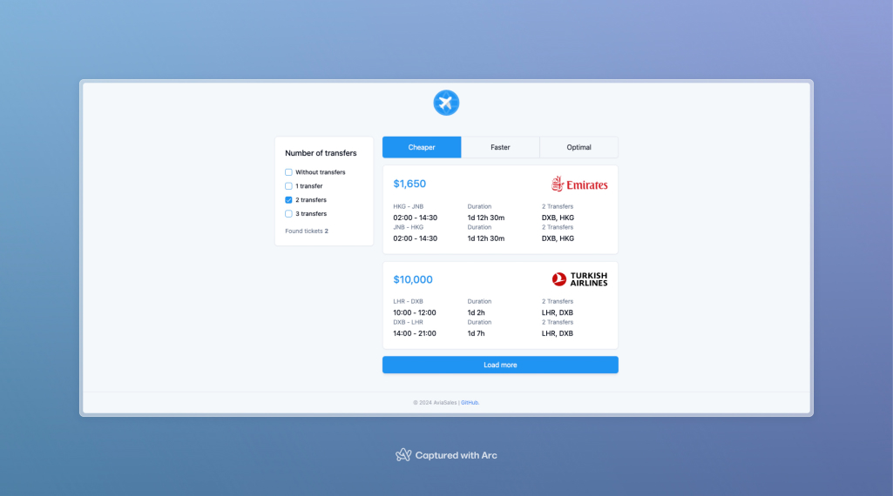

# Project: Fullstack App - Aviasales

## Description

Demo: [https://tickets.floatrx.net/](https://tickets.floatrx.net/)

Server: `Node`, `Express`, `SQLite`, `Prisma`

Client: `React`, `Redux/Redux toolkit`, `ShadCN`, `TailwindCSS`

## ⚙️ Installation

1. Clone the repository
2. Install the dependencies

```bash
# Global
yarn

# Client
cd client
yarn install
cp .env.example .env

# Server
cd ../server
yarn install
cp .env.example .env
```

3. 💻 Run the server & client

```bash
yarn dev
```

### 🚀 Check the app (development mode)

http://localhost:3001 - Client. All API requests are proxied to the server with nginx.

### 🔎 Check database data

```bash
cd server
yarn db:view # prisma studio
```

> [!NOTE]
>
> The database is stored in the `server/prisma/data.db` file and included in the repository.

## 🛳️ Docker

```bash
# Build the app
docker compose build

# or rebuild the app and run
docker compose up --build

# Run the app in the background
docker compose up -d
```

### 🚀 Check the app (docker mode)

The Client APP is accessible at http://localhost:5555. All API requests (/api/) from the client are proxied to the server using nginx.

The server runs on port 3001 within a Docker container (internal network).

### Other Docker commands

```bash
# Check logs
docker compose logs -f

# Stop the app
docker compose down

# Remove the app
docker compose down --volumes
```

# Comments

This app is a fullstack app that uses SQLite as the database. The server is built with Node, Express, and Prisma. The client is built with
React, Redux, Redux toolkit, ShadCN, and TailwindCSS.
Express is used to create the server, Prisma is used to interact with the database, and SQLite is used as the database.

### API contains two endpoints:

1. `[GET] /api/tickets` - returns a list of tickets with optional query parameters `sort`, and `filter`. All filters and sorts are applied
   on the server side. `Optimal index` is calculated as the sum of the flight duration and the number of transfers.
2. `[POST] /api/tickets` - creates a ticket (no UI for this endpoint at this moment)
   Example create ticket request (payload validation is implemented on the server side with `zod`):

```json
{
  "price": 2500,
  "airlineId": 2,
  "flights": [
    {
      "number": "A4E-122",
      "departureTime": "2024-01-01T00:00:00.000Z",
      "arrivalTime": "2024-01-02T22:30:00.000Z",
      "transferIds": [4],
      "fromId": 2,
      "toId": 3
    },
    {
      "number": "EM-123",
      "departureTime": "2024-01-03T00:00:00.000Z",
      "arrivalTime": "2024-01-04T22:30:00.000Z",
      "transferIds": [4],
      "fromId": 3,
      "toId": 2
    }
  ]
}
```

### Database contains 4 tables (models):

1. `Country`
2. `Airline`
3. `Flight`
4. `Ticket`

Check relations between tables in [server/prisma/schema.prisma](server/prisma/schema.prisma)

### Client

Client `contains only one page` with a search form, a list of tickets, and a ticket card component.
The search form allows users to filter tickets by "transfers" (0-3-all) count and sort tickets by "price", flight "duration" and "optimal
index".

> Note: The client is not fully implemented yet and needs some refactoring and improvements.
> Ticket has debug information in the card component. Just click on the ticket to see the debug information.
> Debug information contains the total flight duration, and the optimal index.

## Features

### Backend:

-   [x] Search tickets → Filter & Sort + Validation
-   [x] Create a ticket API + Validation

### Frontend:

-   [x] Search tickets
-   [x] Filter & sort tickets
-   [ ] Create a ticket UI

## Screenshots



## Deployment to VPS
### Approach 1: Proxy api location 
1. Using `pm2` run the server (API). Check the `server/ecosystem.config.js` file for configuration. Check the `PORT` in configuration. Default is `3011`.
2. Build the client (React) and serve the static files using `nginx`. Check the `client/.env` file for the `REACT_APP_API_URL` variable. Default is `/api` (nginx: `proxy_pass`).
```nginx configuration
server {
    server_name tickets.floatrx.net;

    root /var/www/tickets;
    index index.html;

    # Gzip compression
    gzip on;
    gzip_types text/plain application/javascript text/css application/json application/x-font-ttf font/opentype image/svg+xml;
    gzip_min_length 256;

    location / {
        try_files $uri $uri/ /index.html;
    }

    # Cache static files
    location ~* \.(?:ico|css|js|gif|jpe?g|png|woff2?|eot|ttf|svg)$ {
        expires 1y;
        add_header Cache-Control "public, no-transform";
    }

    # Ensure index.html is not cached
    location = /index.html {
        add_header Cache-Control "no-store, no-cache, must-revalidate, proxy-revalidate, max-age=0";
    }

    # Proxy API
    location /api/ {
	proxy_pass http://127.0.0.1:3011/api/;
        proxy_set_header Host $host;
        proxy_set_header X-Real-IP $remote_addr;
        proxy_set_header X-Forwarded-For $proxy_add_x_forwarded_for;
        proxy_set_header X-Forwarded-Proto $scheme;
    }
}
```
### Approach 2: Server and Client with different domains
Instead of `location /api/` use a separate domain for the API:
```nginx configuration
server {
    server_name tickets-api.floatrx.net;

    location / {
        proxy_pass http://127.0.0.1:3011;
        proxy_http_version 1.1;
        proxy_set_header Upgrade $http_upgrade;
        proxy_set_header Connection 'upgrade';
        proxy_set_header Host $host;
        proxy_cache_bypass $http_upgrade;
    }

    access_log /var/log/nginx/tickets-api-access.log;
    error_log /var/log/nginx/tickets-api-error.log;
}

```

> [!NOTE]
> Use `certbot` to generate SSL certificates and configure HTTPS.
