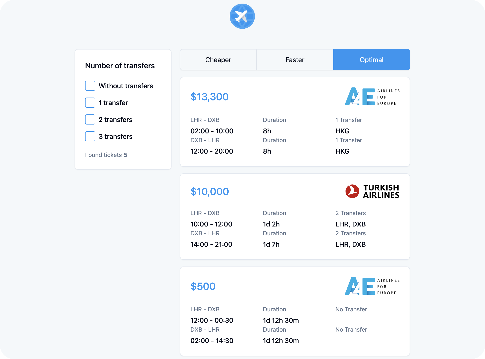

# Project: Fullstack App - Aviasales
## Description
Server: `Node`, `Express`, `SQLite`, `Prisma`

Client: `React`, `Redux`, `Redux toolkit`, `ShadCN`, `TailwindCSS`

## Installation
1. Clone the repository
2. Install the dependencies
```bash
yarn
```
3. Create a `.env` file in `client`/`server` directories
```bash
cp .env.example .env
```
4. Run the server & client
```bash
yarn dev
```

# Comments
This app is a fullstack app that uses SQLite as the database. The server is built with Node, Express, and Prisma. The client is built with React, Redux, Redux toolkit, ShadCN, and TailwindCSS.
Express is used to create the server, Prisma is used to interact with the database, and SQLite is used as the database. 

### API contains two endpoints:
1. `[GET] /api/tickets` - returns a list of tickets with optional query parameters `sort`, and `filter`. All filters and sorts are applied on the server side. `Optimal index` is calculated as the sum of the flight duration and the number of transfers.
2. `[POST] /api/tickets` - creates a ticket (no UI for this endpoint at this moment)
Example create ticket request (no payload validation at this moment):
```json
{
  "price": 2500,
  "airlineId": 2,
  "flights": [
    {
      "number": "A4E-122",
      "departureTime": "2024-01-01T00:00:00.000Z",
      "arrivalTime": "2024-01-02T22:30:00.000Z",
      "transferIds": [4],
      "fromId": 2,
      "toId": 3
    },
    {
      "number": "EM-123",
      "departureTime": "2024-01-03T00:00:00.000Z",
      "arrivalTime": "2024-01-04T22:30:00.000Z",
      "transferIds": [4],
      "fromId": 3,
      "toId": 2
    }
  ]
}
```

### Database contains 4 tables (models):
1. `Country`
2. `Airline`
3. `Flight` 
4. `Ticket`

Check relations between tables in [server/prisma/schema.prisma](server/prisma/schema.prisma)

### Client 
Client `contains only one page` with a search form, a list of tickets, and a ticket card component. 
The search form allows users to filter tickets by "transfers" (0-3-all) count and sort tickets by "price", flight "duration" and "optimal index".

> Note: The client is not fully implemented yet and needs some refactoring and improvements.
> Ticket has debug information in the card component. Just click on the ticket to see the debug information.
> Debug information contains the total flight duration, and the optimal index.

## Features
### Backend:
- [x] Search tickets
- [x] Filter & sort tickets
  
### Frontend:
- [x] Search tickets
- [x] Filter & sort tickets
- [ ] Create a ticket UI

## Screenshots

